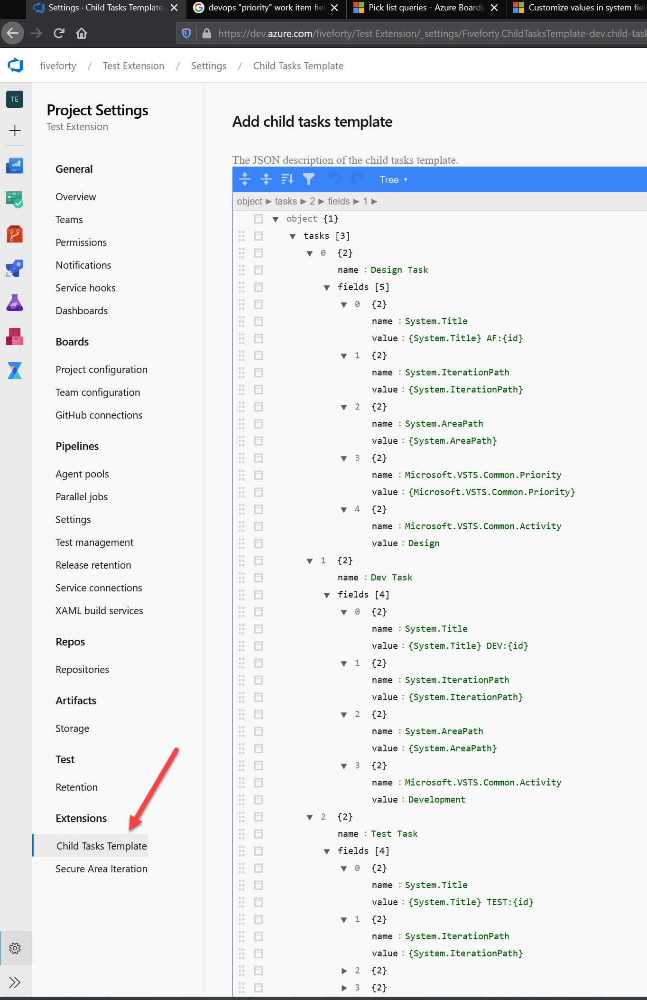

# Child Tasks Template extension

Use this extension to enable creating child tasks from an existing work items and based on a template. Automatically you will be able to generate sub work items under a parent one and with the proper links

## Configuration

You can configure this extension in the project settings page.

Parent field values can be used with string interpolation. Parent field values can be used like this : "My text {Field Type}"

You can also use these special values :

- id : the parent work item ID value
- rev : the parent work item revision number
- url : the parent work item URL

```json
{
  "tasks": [
    {
      "name": "Design Task",
      "fields": [
        {
          "name": "System.Title",
          "value": "{System.Title} test child task for {id}"
        }
      ]
    }
  ]
}
// Parent Work Item > Id:6756; Title:"My demo user story title"
//    => "My demo user story title test child task for 6756"
```



Template sttings example :

[Json template](static/demoTemplate.json)
